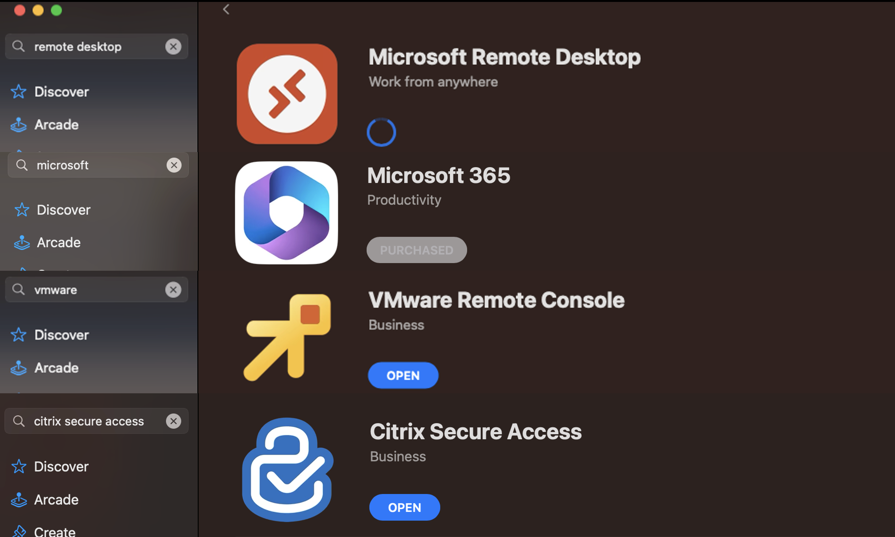
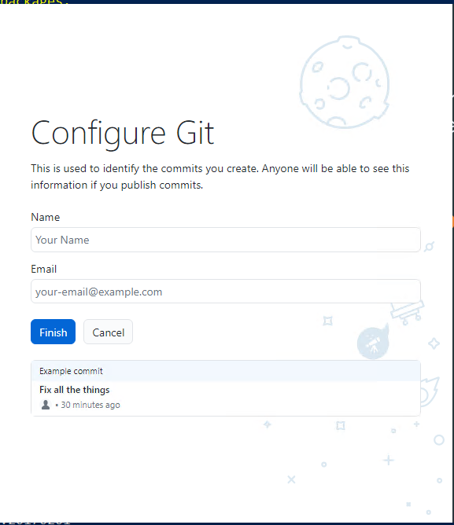

# Installation of basic programs (HAMK BYOD) in students' personal devices (Mac Users)
The following guidelines utilize the **[brew](https://brew.sh/) package manager** for **macOS** to install several applications that are used in different modules in HAMK. 


## Step 1: Installing Apple development environment Xcode and Brew

### Requirements
* A 64-bit Intel CPU or Apple Silicon CPU 1
* macOS Catalina (10.15) (or higher) 2
* Command Line Tools (CLT) for Xcode (from xcode-select --install or https://developer.apple.com/download/all/) or Xcode 3
* Terminal emulator

> Open a Terminal by clicking the [Spotlight](https://support.apple.com/guide/mac-help/search-with-spotlight-mchlp1008/mac) (magnifying glass) icon in the menu bar or press **Command-Space bar**
> Install the required development environment components

```
xcode-select --install
```
> Install Brew package manager

```
/bin/bash -c "$(curl -fsSL https://raw.githubusercontent.com/Homebrew/install/master/install.sh)"
```

> Under "==> Next steps:" Read and copy tree lines of code to terminal and execute it. Here are the examples

```
echo '# Set PATH, MANPATH, etc., for Homebrew.' >> /Users/$USER/.zprofile
echo 'eval "$(/opt/homebrew/bin/brew shellenv)"' >> /Users/$USER/.zprofile
eval "$(/opt/homebrew/bin/brew shellenv)"
```

## Step 2: Programs/Apps Installation using Brew
### The list of apss that you are going to install is as below: <br>
Vscode, vmware-horizon-client, disk-inventory, Git, Github, obs, Vmware-fusion, Google Drive, Google Chrome, UTM virtualization software, Teams, Cyberduck, Docker,  Zoom and Displaylink USB dock drivers.

### To install the above-mentioned programs run the following script
```
brew install --cask visual-studio-code; brew install --cask vmware-horizon-client; brew install --cask disk-inventory-x; brew install --cask zoom; brew install git; brew install --cask github; brew install --cask obs; brew install --cask utm; brew install --cask google-drive; brew install --cask docker; brew install --cask google-chrome; brew install --cask microsoft-teams; brew install --cask cyberduck; brew install --cask displaylink
```

## Step 3: Apple store
We are still missing few basic software for IT studies and basic use. We still need to install *Vmware Horizon client, Microsoft Office and Vmware console* Alternative software to Vmware Horizon client (VDI) is *Citrix Secure Access* a HAMK VPN service. You **can not** run this software at the same time.




## Step 4: Installing some useful VScode addons 

Open a terminal and run the following command to install VScode addons

```
code --install-extension ms-vscode.powershell
code --install-extension vsls-contrib.gistfs
code --install-extension hashicorp.terraform
code --install-extension ms-vscode-remote.remote-containers
code --install-extension ms-azuretools.vscode-docker
code --install-extension ms-vscode-remote.vscode-remote-extensionpack
code --install-extension GitHub.copilot-nightly
code --install-extension GitHub.copilot-labs
```

# Apple UI changes

We recommend a few changes to the mac operating system that will help you with file management and coding. These are Show items on desktop, File Extensions and Path bar.

### Enable show items on desktop and show file extension


### Show file path


### Get hidden files visible (Like .ssh folder)
Go to Parent folder
press Cmd + Shift + . to reveal the hidden folder and files.
When you no longer want to see them click Command + Shift + . again.


# Git and Github
### Create GitHub Account
If you already have a **GitHub account**, you can sign in and if you don't have one, you can create a new GitHub account. 

  1.  Please use your personal email id to create a GitHub account. 
  2.  Go to [https://github.com/settings/emails](https://github.com/settings/emails) and add your student HAMK email
  3.  Activate [https://education.github.com/pack](https://education.github.com/pack). HAMK email needs to be added before activation. Depending on the situation you will maybe need to be verified. Use your mobile student card to verify yourself.

### Configure Git
You need to configure Git by providing your full name and email address. Use the same email address that you used to sign up for GitHub.




***Congratulations, you have installed most of the required applications that you need while studying at HAMK. Over time, you will need to install additional applications.***

## All done! Here are some recommended apps for faster multitasking.

### Mac Windows manager / Windows snaping tool
* [https://rectangleapp.com/](https://rectangleapp.com/)

### Per-device scrolling preferences on macOS.
* [https://github.com/pilotmoon/Scroll-Reverser](https://github.com/pilotmoon/Scroll-Reverser)

### Warp terminal 
* [Warp terminal](https://www.warp.dev/) and [New *incredible* macOS terminal! (warp + starship + zsh)](https://www.youtube.com/watch?v=NfggT5enF4o)


