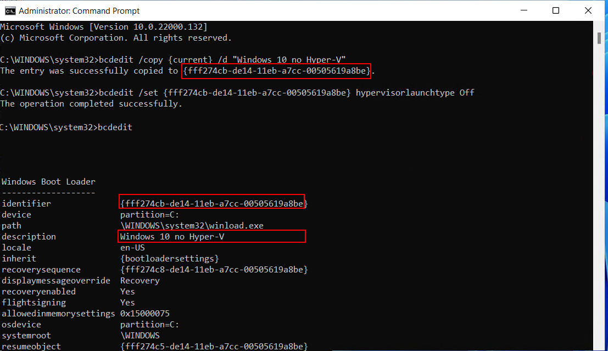

# How to update Windows 11 license from home to education and activate Hyper-V
You need a working (HAMK) student ID to activate the Windows license.

## Step 1: How to update Windows 11 license from home to education 

### Backup Windows license
* Start Powershell or Command Prompt (CMD) 
* Run a command
```
wmic path SoftwareLicensingService get OA3xOriginalProductKey
```
* Save it in a safe place 😊

### Getting a new Windows 11 Education license
Log in to [Azure For Education](https://azureforeducation.microsoft.com/devtools) <br>
Find Windows 11


* View Key and save it to your computer
** Click start menu and type Windows activation


* Choose Change product key and input your License key for Windows 11. <br>
Windows license update will end in strange error THAT IS A NORMAL MICROSOFT WAY TO SAY **“JOB WELL DONE”**. 
Restart your computer and Windows will activate new license in 1-3 minutes. 

## Step 2: Activate Hyper-V 

### TMP / Enabling Virtualization in BIOS/UEFI
- [How to enable virtualization? ](https://www.isumsoft.com/computer/enable-virtualization-technology-vt-x-in-bios-or-uefi.html) <br>
- [How to access BIOS settings for different manufacturer? ](https://2nwiki.2n.cz/pages/viewpage.action?pageId=75202968)


### Activate Hyper-V

* Start Powershell with Adminitrator rights (Run as Administrator)

```
Enable-WindowsOptionalFeature -Online -FeatureName Microsoft-Hyper-V -All
```


*Restart your computer finalize the changes to your operating system*
***Congratulations, you have updated your Windows 11 licence and activated Hyper-v***

## FAQ / Problem solving

### Hyper-V still not working?

Forcing Hyper-V to start using Windows bootloader. 

* Start Powershell with Adminitrator rights (Run as Administrator)

```
bcdedit /set hypervisorlaunchtype auto
```
 
### Need to shut down Hyper-V for compative gaming? 

Let's generate new Windows boot option for NO Hyper-V running. *You need to modify the command to match the bootloader tag*



```
  bcdedit /copy {current} /d "Windows 11 no Hyper-V"
  bcdedit /set {Add your identifier here} hypervisorlaunchtype Off
```

